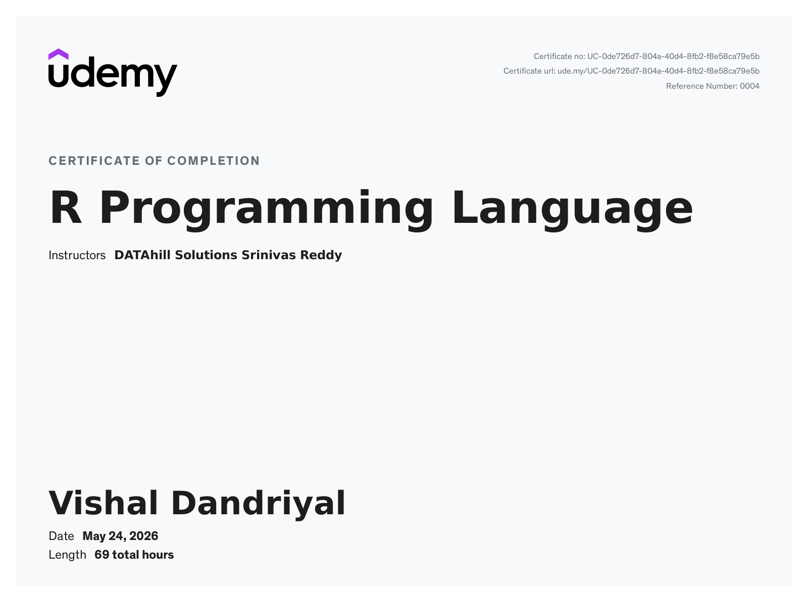
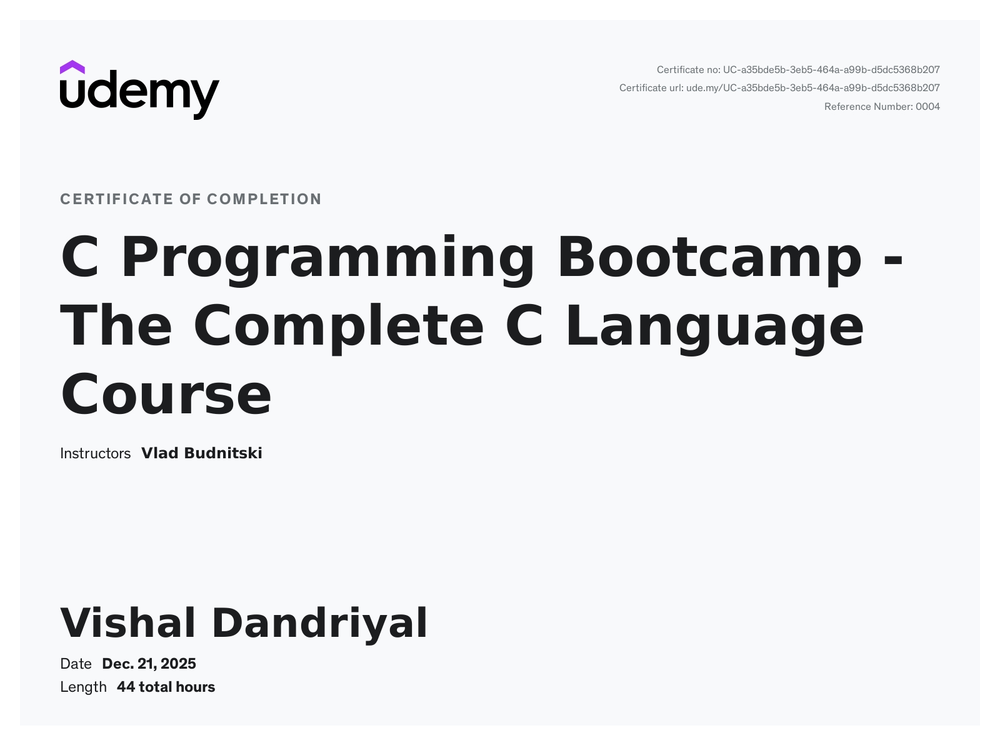

<h1 align="center">Hi , I'm Vishal Dandriyal</h1>
<h3 align="center">🚀 Aspiring Data Scientist | 💻 Programming Enthusiast</h3>

  

---

## 🧠 About Me

- 🌱 Currently exploring **Data Science & Data Analytics**
- 💻 Working with **PYTHON ,C & R Programming**
- 📊 Learning **Machine Learning & Visualization**
- 🎯 Goal: **Become a Data Scientist**

---

## 🛠️ Tech Stack

---

## 📜 Certifications

### 📊 R Programming  

  

 

### 💻 C Programming  

  

---

## 📊 GitHub Analytics

| | |
| :---: | :---: |
|  |  |

---

## 📈 Most Used Languages

  

---

## 🌐 Connect With Me

  

---

## ⚡ Fun Fact

I turn data into stories and curiosity into code 📊✨

